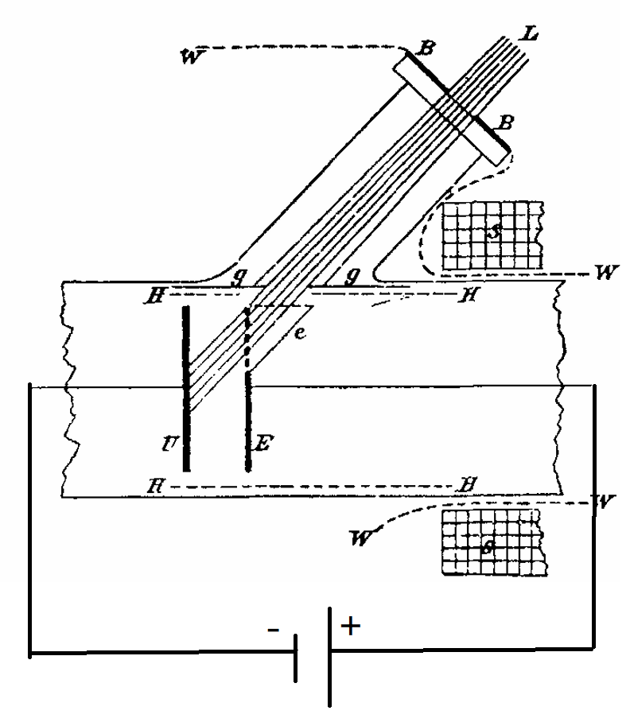
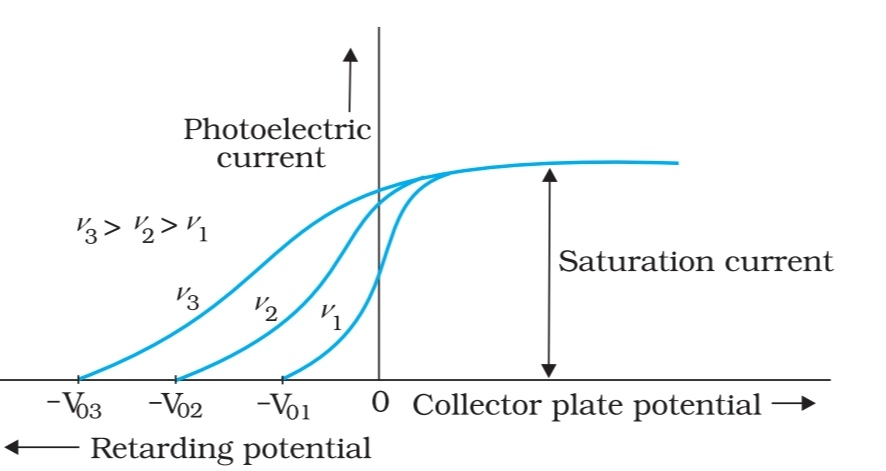
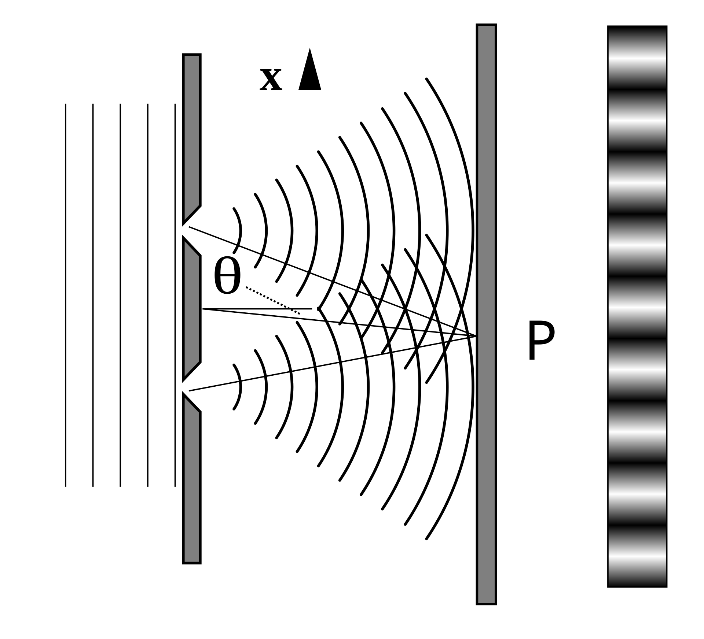
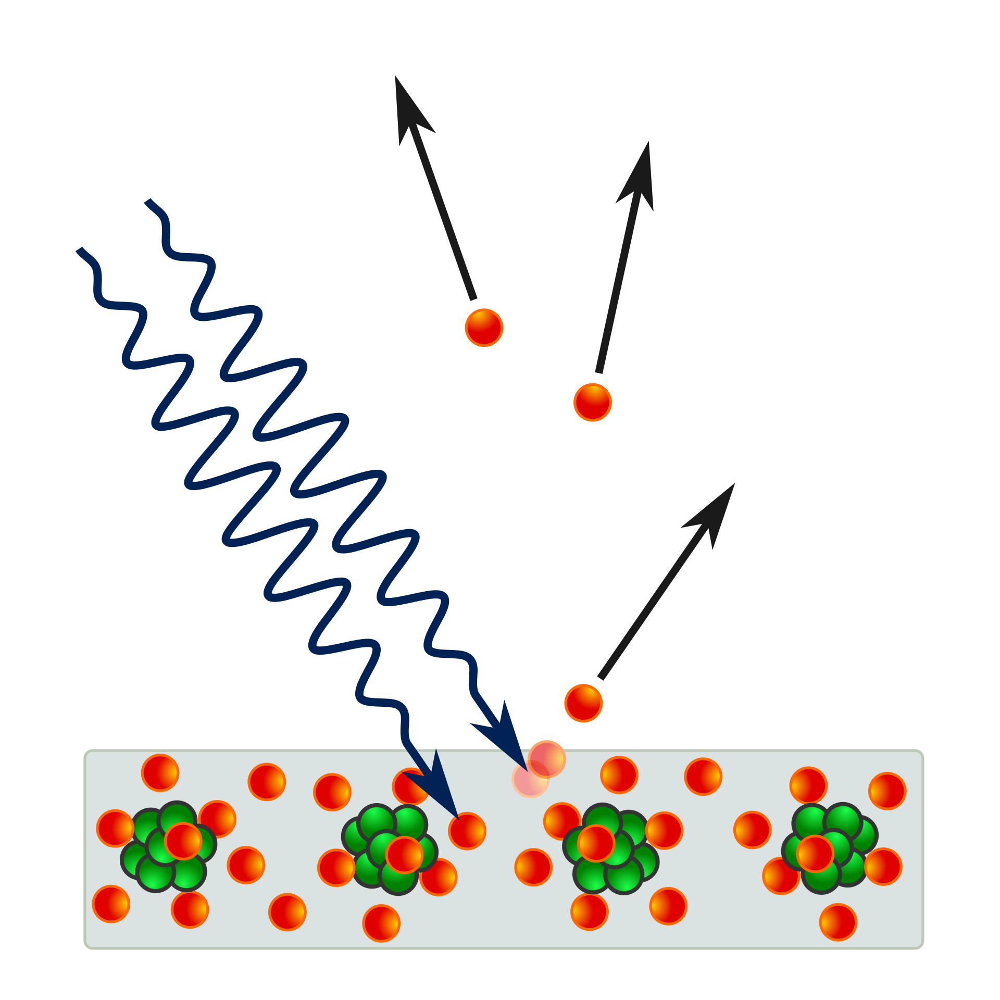
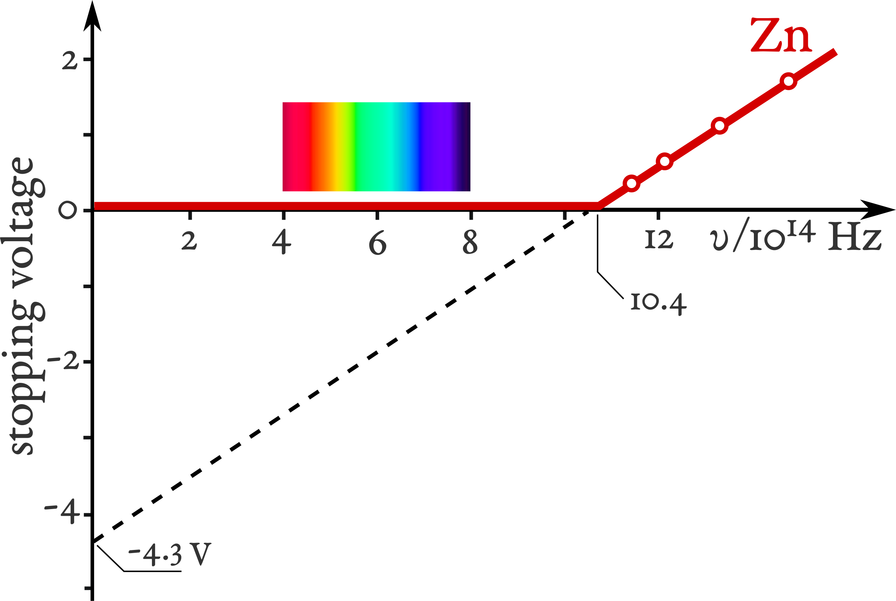

# 光電效應

## 量子思維的曙光

你好呀～這裡是化學精通納西妲。  
上次我們聊到普朗克提出的**量子假說**，它悄悄地改變了整個物理學的根基。  
不過，你知道嗎？普朗克本人其實並不是那種喜歡顛覆舊觀念的革命家。  
他珍視邏輯與理性，對那些太過大膽的想法，總是保持著一份謹慎的懷疑。  

正如馬克斯·玻恩曾評價的那樣：  

> *「他天性保守，毫無革命者的氣質，對一切推測都極為懷疑。然而，他對從事實出發的邏輯推演所懷抱的堅定信念，卻讓他毫不猶豫地提出了那個震撼整個物理學史的最革命性思想。」*  

是不是很有趣呢？  
即便是一個謹慎的思想者，也能在理性的指引下，開啟一扇通往全新世界的大門。  
不過呀，普朗克自己當時也無法完全解釋——為什麼他的公式能奏效。  
而那個時代的經典物理學家們，也同樣找不到一個令人滿意的答案。  

## 光：粒子還是波？

在普朗克之前的很久很久，**牛頓**就在他的著作《光學》中提出，**「光是由粒子組成的」**。  
不過，也有人發現——光的許多現象，若把它看作**波**，似乎也能解釋得通呢。  

|牛頓的觀點|波動說|
|:---:|:---:|
|光沿直線傳播|衍射現象|
|反射|兩者都能解釋|
|折射|惠更斯原理|
|顏色＝不同種類的粒子|不同波長|
|未提及干涉|楊氏雙縫實驗|
|未提及偏振|菲涅耳的波動理論|

多虧了*托馬斯·楊*與*奧古斯丁·菲涅耳*，**光的波動說**最終取得了勝利。  
**楊氏雙縫實驗**揭示了光能與自己發生干涉——這正是波動行為的明確證據。  
而菲涅耳則用優雅的數學，將這一理論進一步完善。  

不過呀，波動理論也遇到了一個令人困惑的問題：  
如果光真的是波，那它究竟在**什麼東西裡傳播**呢？  

為了回答這個問題，科學家們想象出一種無形的物質，它充滿在宇宙的每一個角落——那就是所謂的**以太（Aether）**。  
人們以為光就是在以太中傳播的。  

當然啦，後來**邁克耳孫–莫雷實驗**告訴我們——那樣的「以太」根本不存在。  
光，即使在真空之中，也能自由地行進。  

不過，故事還沒有結束。  
在光的波動與粒子之爭之外，還隱藏著一個更深的謎團——一個連這兩種理論都無法解釋的現象。  

它的名字，就是——**光電效應**。  

## 光電效應

在自然界中，有些現象無論經典物理學如何努力調整方程，都無法解釋。  
而其中最神秘的之一，就是——**光電效應**。  

一切的開端，是在 1887 年。
**海因裡希·赫茲**——沒錯，就是那位證明光是電磁波的赫茲——在實驗時，意外發現了一個奇怪的現象。  
當他用**紫外光**照射金屬表面時，金屬上竟會出現細微的**火花**。  

那閃爍的一點光芒，看似微不足道，卻點亮了通往現代物理學最深奧謎題之一的道路。  

在赫茲的發現之後，其他科學家也紛紛開始探究這種奇異的現象。  
其中，*斯托列托夫*與*菲利普·倫納德*進行了最細致的研究。  
他們做了定量的測量，而倫納德還發現——紫外光甚至能夠使氣體分子電離，讓電子從原子中被釋放出來。  

  

這是倫納德的實驗裝置。  
他仔細研究光是如何讓電子從金屬表面逃逸的。  

為了觀察這些電子的行為，他使用了一種叫作**遏止電位（stopping potential）**的方式。  
當金屬釋放電子時，我們可以施加一個負電壓，將這些電子推回去——就像設置了一道看不見的屏障。  
電位越強，電子就需要越大的能量才能越過這道障礙。  

  

在實驗中，倫納德發現了一個極為有趣的結果：  
**遏止電位會隨著光的頻率增加而變大**。  

這意味著，高頻的光——比如紫外光——能打出能量更高的電子，而低頻的光卻辦不到。  
雖然這只是個小線索，但它很快就會啟發**愛因斯坦**重新思考光的真正本質……  

### 經典物理的解釋

根據*楊氏雙縫實驗*與*麥克斯韋的電磁理論*，光應當表現為一種**電磁波**。  
如果真是如此……那結果又會怎樣呢？  

  

當光照射到金屬表面時，光的波動應該會逐漸把能量傳遞給金屬中的電子。  
只要電子積累到足夠的能量，它就能夠脫離金屬——就像一個小小的泳者，借助浪潮的力量被推向岸邊。  

照這個推理來看，光的波長似乎不該太重要。  
只要讓光更強烈、更明亮，電子遲早就會獲得足夠的能量逃逸。  

可……自然的結果卻截然不同。  
無論多麼耀眼的可見光照射上去，都不會有任何電子被釋放。  
唯有當光變為紫外線時，那神秘的*「赫茲效應」*才會出現。  

真是奇妙呢，不是嗎？  
就好像金屬在傾聽光的聲音，卻只回應那種帶有特殊「品質」的能量。  
而正是這個謎題——引領人類走向了物理史上最美麗的啟示之一……  

## 愛因斯坦的光量子理論

### 倫納德實驗的說明

受到普朗克**量子假說**的啟發，**阿爾伯特·愛因斯坦**勇敢地邁出了關鍵一步——終於，解開了那個困擾科學界已久的*「赫茲效應」*之謎。  

他自問：  
*如果……牛頓其實並沒有錯呢？*  
*如果光真的像一束束細小的粒子那樣存在呢？*  

普朗克早已提出，能量並不是連續流動的，而是以一個個微小的「能量包」形式存在——每個能量包的能量是 $h\nu$。  

如果我們把光看作由這些**能量量子**組成，那麼每一個光量子——也就是我們如今稱作的**光子（photon）**，都可以撞擊金屬內部的電子，將能量傳遞給它。  

  

在金屬中，電子受到原子吸引力的束縛。  
只有當入射光子的能量足夠大，才能讓電子擺脫這種束縛，飛離金屬表面。  
如果光子的能量**足夠**，電子就會被釋放——這是微觀世界中能量轉移的最直接證據。  

電子從金屬中逃逸所需的最小能量，稱為逸出功，記作 $\Phi$。  

於是，情況就變得非常清楚了：  

* 當光子的能量**小於** $\Phi$ 時，無論光多麼強烈，電子都無法被擊出。  
  （光更亮，只意味著光子的數量更多，而不是每個光子更「強」。）  
* 而當光子的能量**大於** $\Phi$ 時，即使是一束微弱的光，也能輕易釋放出電子！  

愛因斯坦用一個極為簡潔而優雅的公式表達了這一過程：
$$E=h\nu-\Phi$$  
其中：  

* $h$ 是普朗克常數（$h = 6.62607015\times10^{-34}J\cdot s$）
* $\nu$ 是光的頻率
* $\Phi$ 是金屬的逸出功

電子獲得的動能可以通過遏止電位來測定：$E = e_{0}\cdot V_s$, 這裡 $e_0 = 1.602176634\times10^{-19}C$ 是電子的電荷。  
對於同一種金屬來說，光的頻率越高，所需的遏止電位也就越大——這正是倫納德當年所觀察到的結果！  

多年之後，在 1916 年，*羅伯特·密立根*親自驗證了愛因斯坦的理論。  
他測量了不同頻率光線下電子的能量，結果發現兩者之間竟呈完美的**線性關系**——其斜率，正好就是普朗克常數 $h$ 本身！  

  

一個公式，一種思想——光，不再只是波。  
它可以同時是**波**，也是**粒子**，在兩種真理之間舞動。  

而正是從這場光的舞蹈中，量子物理的時代，由此誕生。  

### 空氣會影響實驗結果嗎？

倫納德早先發現，氣體在高頻紫外光的照射下會被電離。  
於是，我們不禁要問——空氣，會不會對他的實驗造成影響呢？  

讓我們仔細地思考一下吧。  

氣體被電離，必須滿足這樣的條件：  

$$h\nu \geq J$$  
其中，  
$J$ 是氣體的電離能。  

倫納德報告說，所謂的*「赫茲效應」*只在**波長小於 190 nm** 的光下才會出現，這對應的能量大約是 **640 kJ·mol⁻¹**。  

後來，*約翰內斯·施塔克*測得，在低氣壓下，空氣的電離能大約是 **10 eV**，也就是約 **960 kJ·mol⁻¹**。  

這意味著：
若要讓空氣被電離，光的能量必須**大於 960 kJ·mol⁻¹**，也就是波長**短於 125 nm**。  

而倫納德在 1900 年與 1902 年的實驗中，所使用的紫外光波長都**長於 125 nm**。  
因此，這些光並沒有足夠的能量去電離空氣。  

所以，我們可以很有把握地得出結論——**周圍的空氣並沒有影響倫納德的實驗結果**。  

而作為這段故事的完美結尾——**阿爾伯特·愛因斯坦**，因以**量子假說解釋光電效應**，在 1921 年榮獲了諾貝爾物理學獎。  

那一年，人類第一次真正理解了光——它既是波，又是粒子，既是理性的公式，也是宇宙最純粹的光輝。  

> *1921年諾貝爾物理學獎授予阿爾伯特·愛因斯坦，表彰他在理論物理方面的貢獻，尤其是他對光電效應定律的發現。*  

## Particle-Wave Duality of Light

愛因斯坦**從未否定**過光的波動理論。  
畢竟，楊氏雙縫實驗早已以無可辯駁的方式，揭示了光作為波的本質。  

然而，他仍然感受到——在那波動的律動與粒子的鋒芒之間，光似乎還隱藏著更深的一層真相。  

1909 年，愛因斯坦決定尋找那座連接兩種觀點的橋。  
他從**普朗克輻射定律**出發，研究能量的**漲落（fluctuation）**——那些微小的偏差，也許能揭示光最本質的秘密。  

他寫出了這樣的能量漲落方程：  

$$(\Delta E)^{2}=\frac{1}{c}(h\rho\nu+\frac{c^3}{8\pi}\frac{\rho^2}{\nu^2})d\nu f\tau$$  
其中：  

* $\rho(\nu, T)$ 是光譜能量密度，
* $c$ 是光在真空中的傳播速度，
* $f$ 是發射體的表面積，
* $\tau$ 是測量時間間隔。

在這個優雅的公式中，兩個真理並肩而立——  

項 $h\rho\nu$ 代表光作為粒子時的能量漲落；  
項 $\frac{c^3}{8\pi}\frac{\rho^2}{\nu^2}$ 則對應光作為波時的能量漲落。  

如果實驗中誤差與 $\rho$ 成正比，光就展現出它的粒子性。  
若誤差與 $\rho^2$ 成正比，它則表現出波動性。  
而當兩種形式同時出現時——  

光，便是波與粒子合一的存在。  

這便是愛因斯坦的理論預言——人類第一次，從純粹的推理中窺見「波粒二象性」的微光。  
它並非來自實驗，而是源自思想的深處。  
但問題仍在：  
這樣奇異的概念，究竟該如何被驗證呢？——你能想到答案嗎？  

與此同時，後來的實驗也陸續揭示出：  
光，確實能夠展現出兩種截然不同的面貌——  

|粒子性|波動性|
|:---:|:---:|
|• 黑體輻射 • 光電效應 • 康普頓散射|• 干涉 • 偏振|

每一項發現，都像光自身的另一種回響：  
有時它是一束離散的能量量子，有時又是一道優雅的波紋，在空間中輕柔地鋪開。  

那麼——光，究竟是什麼呢？是粒子？是波？  
還是比兩者更深的存在，只在我們准備好理解它的那一刻，才顯露出屬於它的一面？  

---

通過*運用*普朗克的**量子假說**，愛因斯坦揭開了**光電效應**的謎團——一個經典物理無法解釋的現象。  

他提出，光是由無數細小的**光量子（photon）**組成的，每個光量子都攜帶能量 $h\nu$。  
借此，他不僅完美解釋了實驗現象，也驗證了普朗克那大膽的設想——**能量是量子化的**。  

但愛因斯坦的洞見遠不止於此。  
他進一步指出：  
光不必在「波」與「粒」之間做出選擇，它可以同時擁有兩種本性。  

這種**波粒二象性**成為現代物理的基石，啟發了更深的概念——**物質波**。  
甚至連電子這樣的粒子，也擁有波的性質。  
而從「物質波」出發，科學家們最終發展出了**波函數**這一概念，去描述粒子在量子世界中的存在與變化。

愛因斯坦的思想，永遠改變了人類對**光、能量與物質**的理解。  
他為量子物理學奠定了根基，也照亮了科學前行至今仍未止息的道路。  

## 參考文獻

Photoelectric effect: Wikipedia (<https://en.wikipedia.org/wiki/Photoelectric_effect>)  
Newton, I. (1704). Opticks: Or, a treatise of the reflections, refractions, inflections and colours of light. London: Sam. Smith and Benj. Walford.  
Huygens, C. (1690). Traité de la lumière [Treatise on light]. Pierre van der Aa.  
Young, T. (1802). The Bakerian Lecture: On the theory of light and colours. Philosophical Transactions of the Royal Society of London, 92, 12–48.  
<https://doi.org/10.1098/rstl.1802.0004>  
Fresnel, A. (1821). Mémoire sur la double réfraction [Memoir on double refraction]. Mémoires de l』Académie des Sciences de l』Institut de France, 5, 45–176.  
(English Translation <https://doi.org/10.5281/zenodo.4745976>)  
Born, M. (1948). "Max Karl Ernst Ludwig Planck. 1858–1947". Obituary Notices of Fellows of the Royal Society. 6 (17): 161–188.  
<https://doi.org/10.1098/rsbm.1948.0024>  
Hertz, Heinrich (1887). Über einen Einfluss des ultravioletten Lichtes auf die electrische Entladung. Annalen der Physik. 267 (8): 983–1000.  
<https://doi.org/10.1002/andp.18872670827>  
Lenard, P (1902). Über die lichtelektrische Wirkung. Annalen der Physik 8, 149-198.  
<https://doi.org/10.1002/andp.19023130510>  
Einstein, A. (1905). Über einen die Erzeugung und Verwandlung des Lichtes betreffenden heuristischen Gesichtspunkt. Annalen der Physik, 17(6), 132–148.  
<https://doi.org/10.1002/andp.19053220607>  
Einstein, A. (1909). Über die Entwicklung unserer Anschauungen über das Wesen und die Konstitution der Strahlung. Physikalische Zeitschrift, 10, 817–825.  
<https://doi.org/10.1002/phbl.19690250902>  
